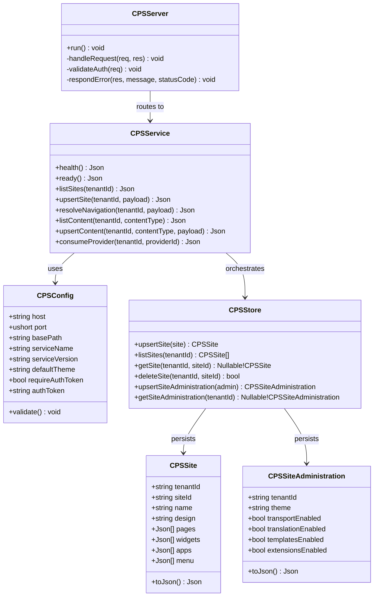
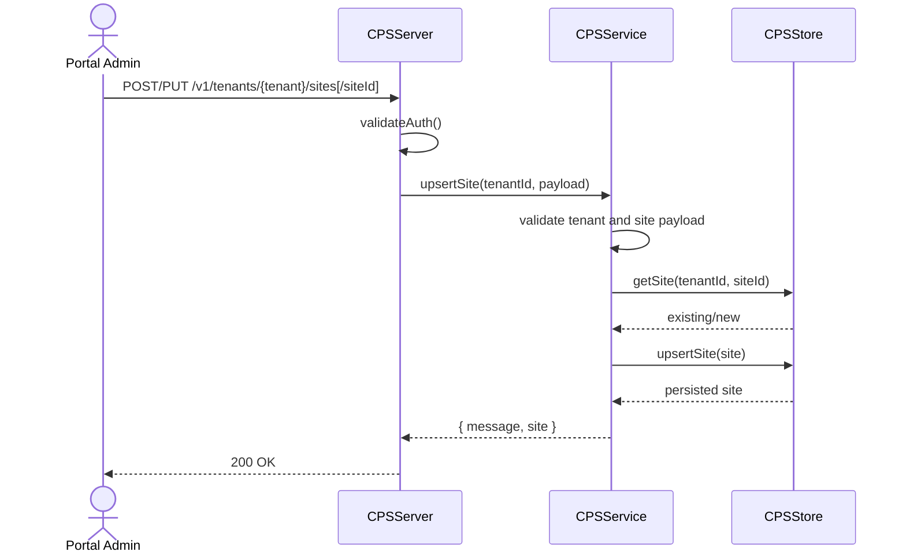
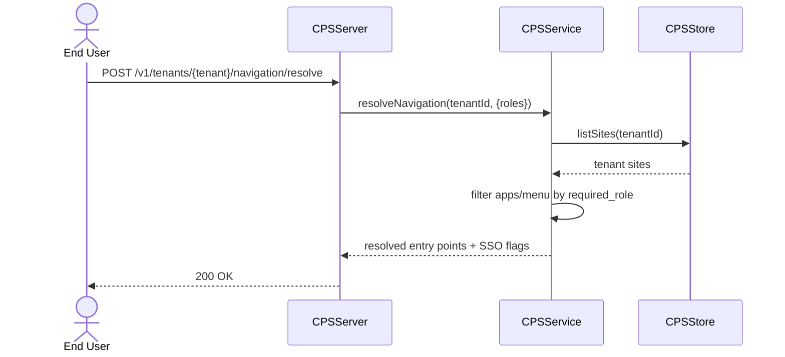

# UIM Cloud Portal Service (CPS)

Kubernetes-compatible SAP Cloud Portal Service style runtime built with D, `vibe.d`, and `uim-framework`.

## Features

- Intuitive and engaging user experience by creating sites with pages, apps, widgets, and menus using SAP Fiori 3 or custom designs
- Secure access to apps through role-based navigation and single sign-on for app types such as SAPUI5, SAP GUI for HTML, and Web Dynpro ABAP
- Central entry point to integrate and access content from SAP and non-SAP content providers uniformly
- Site administration tools for full lifecycle operations: themes, transport, translation, templates, and extensions
- Content administration tools for `apps`, `roles`, `groups`, and `catalogs`
- Embedded launchpad module support with runtime capabilities such as personalization, translation, and custom themes
- SaaS content provider exposure so business solutions can be consumed through the Cloud Portal service

## Build and Run

```bash
cd "Cloud Portal Service"
dub build
./build/uim-sap-cps-service
```

Environment variables:

- `CPS_HOST` (default `0.0.0.0`)
- `CPS_PORT` (default `8089`)
- `CPS_BASE_PATH` (default `/api/cps`)
- `CPS_SERVICE_NAME` (default `uim-sap-cps`)
- `CPS_SERVICE_VERSION` (default `1.0.0`)
- `CPS_DEFAULT_THEME` (default `sap_fiori_3`)
- `CPS_AUTH_TOKEN` (optional bearer token)

## Podman Container

```bash
cd "Cloud Portal Service"
podman build -t uim-sap-cps:local -f Dockerfile .
podman run --rm -p 8089:8089 --name uim-sap-cps uim-sap-cps:local
```

## REST API

Base path: `/api/cps`

- `GET /health`
- `GET /ready`
- `GET /v1/tenants/{tenant_id}/sites`
- `POST /v1/tenants/{tenant_id}/sites`
- `GET /v1/tenants/{tenant_id}/sites/{site_id}`
- `PUT /v1/tenants/{tenant_id}/sites/{site_id}`
- `DELETE /v1/tenants/{tenant_id}/sites/{site_id}`
- `POST /v1/tenants/{tenant_id}/navigation/resolve`
- `GET /v1/tenants/{tenant_id}/entrypoints`
- `GET /v1/tenants/{tenant_id}/admin/site-tools`
- `PUT /v1/tenants/{tenant_id}/admin/site-tools`
- `GET /v1/tenants/{tenant_id}/content/{apps|roles|groups|catalogs}`
- `POST /v1/tenants/{tenant_id}/content/{apps|roles|groups|catalogs}`
- `GET /v1/tenants/{tenant_id}/launchpad/modules`
- `POST /v1/tenants/{tenant_id}/launchpad/modules`
- `GET /v1/tenants/{tenant_id}/providers`
- `POST /v1/tenants/{tenant_id}/providers`
- `POST /v1/tenants/{tenant_id}/providers/{provider_id}/consume`

### Example: create site

```bash
curl -X POST "http://localhost:8089/api/cps/v1/tenants/acme/sites" \
  -H "Content-Type: application/json" \
  -d '{
    "name": "Acme Business Site",
    "design": "sap_fiori_3",
    "pages": [{"id": "home", "title": "Home"}],
    "widgets": [{"type": "kpi", "name": "Sales KPI"}],
    "apps": [
      {"id": "app-sales", "title": "Sales", "required_role": "sales-user", "app_type": "SAPUI5"}
    ],
    "menu": [{"title": "Home", "target": "home"}]
  }'
```

### Example: resolve role-based navigation with SSO

```bash
curl -X POST "http://localhost:8089/api/cps/v1/tenants/acme/navigation/resolve" \
  -H "Content-Type: application/json" \
  -d '{"roles": ["sales-user"]}'
```

## Kubernetes

```bash
kubectl apply -f k8s/configmap.yaml
kubectl apply -f k8s/deployment.yaml
kubectl apply -f k8s/service.yaml
```

## UML Description

Note: Render the following diagrams with a PlantUML-compatible Markdown viewer/extension.

### Class Diagram



### Sequence Diagram (Create/Update Site)



### Sequence Diagram (Role-based Navigation Resolution)



  ### Sequence Diagram (Provider Content Consumption)

  ```mermaid
  sequenceDiagram
    actor Admin as Content Admin
    participant API as CPSServer
    participant Svc as CPSService
    participant Store as CPSStore

    Admin->>API: POST /v1/tenants/{tenant}/providers/{providerId}/consume
    API->>API: validateAuth()
    API->>Svc: consumeProvider(tenantId, providerId)
    Svc->>Store: getProvider(tenantId, providerId)
    Store-->>Svc: provider config
    Svc->>Svc: fetch/transform provider content
    Svc->>Store: upsertContent(apps/roles/groups/catalogs)
    Store-->>Svc: persisted tenant content
    Svc-->>API: { message, consumed_items }
    API-->>Admin: 200 OK
  ```
