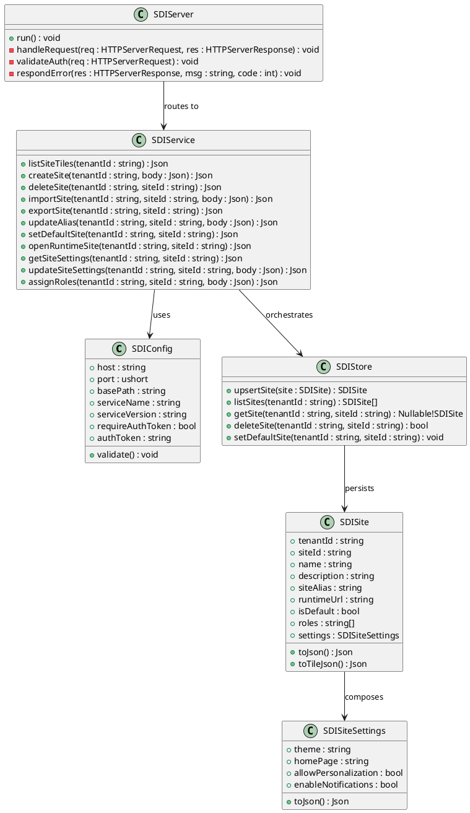
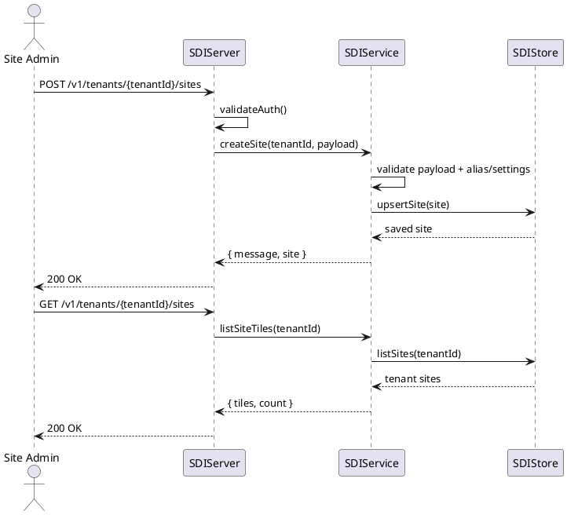
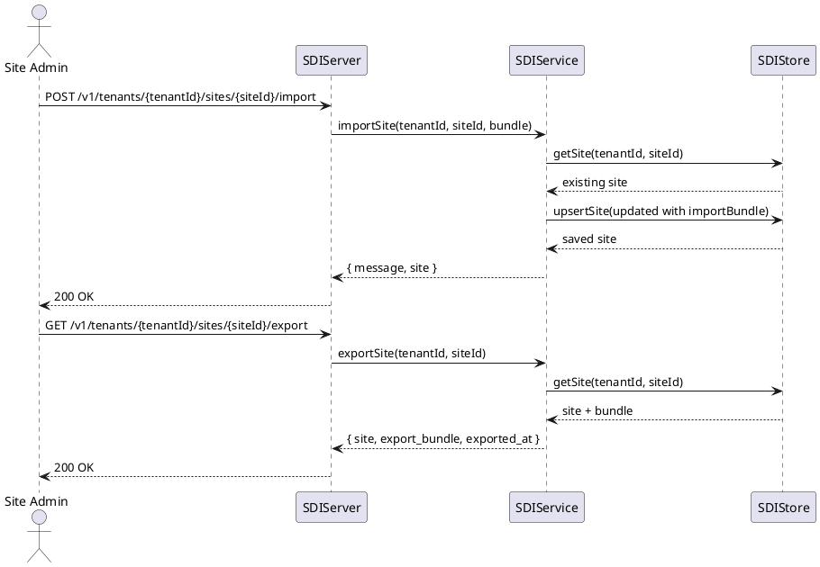
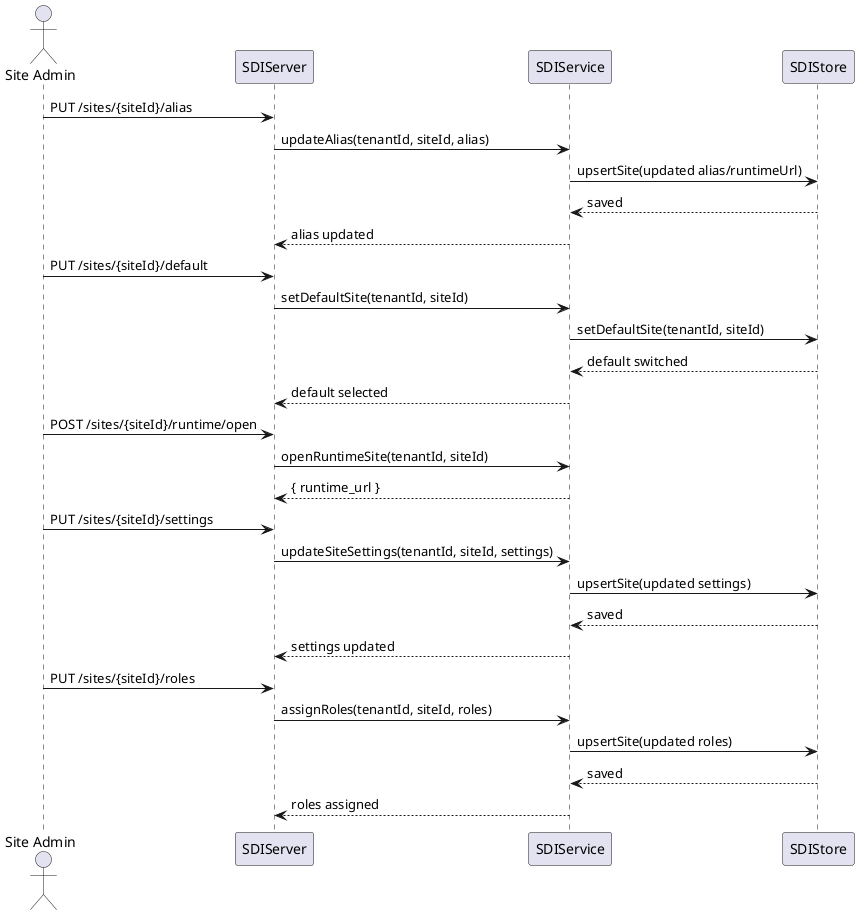

# Site Directory UML

## Class Diagram

## Sequence Diagram: Create and Display Site Tile

## Sequence Diagram: Import and Export Site

## Sequence Diagram: Alias, Default Site, Runtime, Settings and Roles

