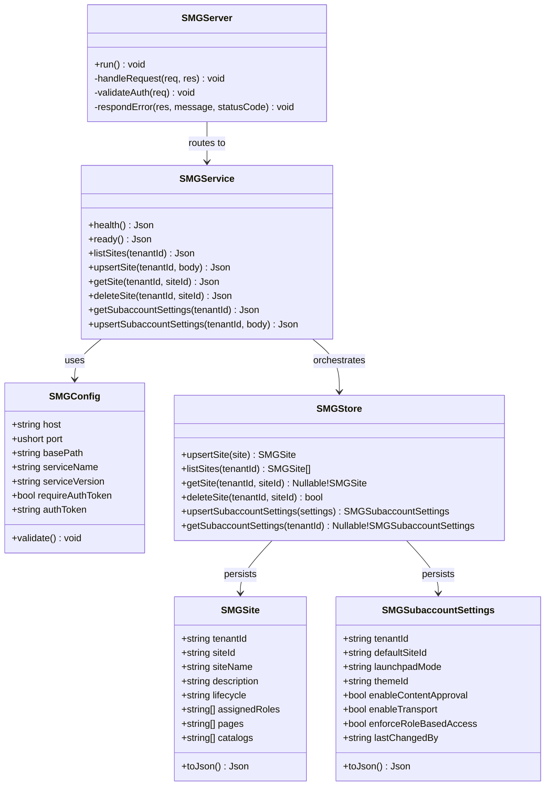
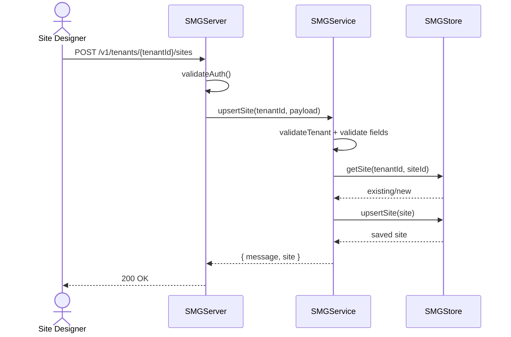
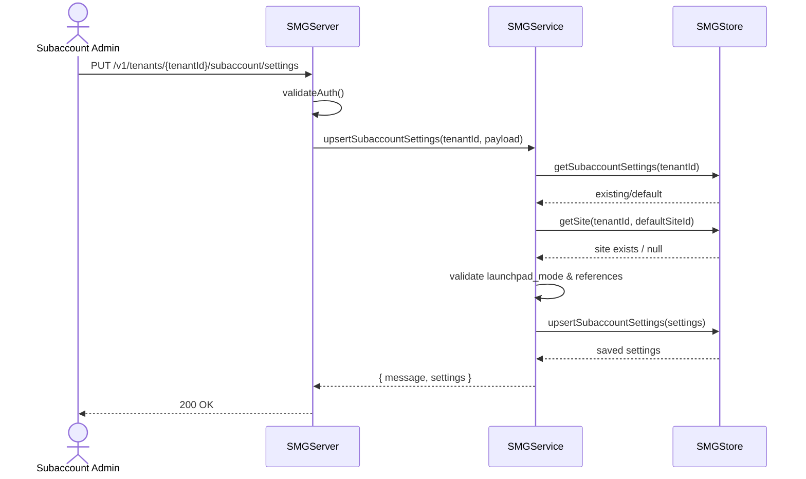

# Site Manager Service

This service provides a **SAP BTP Site Manager-like design-time API** for managing tenant sites and subaccount-level launchpad settings.

## Features

- **Design-time site management**
  - Create, update, list, fetch, and delete sites per tenant.
  - Track lifecycle state (`draft`, `published`, `archived`).
  - Maintain page/catalog/role assignments for each site.

- **Subaccount-level settings management**
  - Configure default site, launchpad mode, and theme.
  - Toggle content approval, transport, and role-based enforcement.
  - Keep audit metadata (`last_changed_by`, `updated_at`).

- **Multi-tenancy support**
  - Tenant isolation via `/v1/tenants/{tenantId}/...` APIs.

- **Operational readiness**
  - Health endpoint: `GET /api/sitemanager/health`
  - Readiness endpoint: `GET /api/sitemanager/ready`
  - Optional bearer token auth via `SMG_AUTH_TOKEN`.

## Build

```bash
dub build --root="./Site Manager"
```

## Run

```bash
SMG_AUTH_TOKEN=local-token dub run --root="./Site Manager"
```

Service defaults:

- Host: `0.0.0.0`
- Port: `8094`
- Base path: `/api/sitemanager`

## API Overview

### Site management

- `GET /api/sitemanager/v1/tenants/{tenantId}/sites`
- `POST /api/sitemanager/v1/tenants/{tenantId}/sites`
- `GET /api/sitemanager/v1/tenants/{tenantId}/sites/{siteId}`
- `PUT /api/sitemanager/v1/tenants/{tenantId}/sites/{siteId}`
- `DELETE /api/sitemanager/v1/tenants/{tenantId}/sites/{siteId}`

Create/update payload example:

```json
{
  "site_id": "launchpad-main",
  "site_name": "Main Launchpad",
  "description": "Primary site for business users",
  "lifecycle": "draft",
  "assigned_roles": ["Employee", "Manager"],
  "pages": ["home", "approvals"],
  "catalogs": ["hr", "finance"]
}
```

### Subaccount settings

- `GET /api/sitemanager/v1/tenants/{tenantId}/subaccount/settings`
- `PUT /api/sitemanager/v1/tenants/{tenantId}/subaccount/settings`

Settings payload example:

```json
{
  "default_site_id": "launchpad-main",
  "launchpad_mode": "spaces",
  "theme_id": "sap_horizon_dark",
  "enable_content_approval": true,
  "enable_transport": true,
  "enforce_role_based_access": true,
  "last_changed_by": "admin@tenant.example"
}
```

## Podman

From repository root:

```bash
podman build -t uim-sap-smg:latest "./Site Manager"
podman run --rm -p 8094:8094 \
  -e SMG_AUTH_TOKEN=local-token \
  uim-sap-smg:latest
```

## Kubernetes

```bash
kubectl apply -f "./Site Manager/k8s/configmap.yaml"
kubectl apply -f "./Site Manager/k8s/deployment.yaml"
kubectl apply -f "./Site Manager/k8s/service.yaml"
```

Optional auth secret:

```bash
kubectl create secret generic uim-sap-smg-secret \
  --from-literal=authToken=local-token
```

## UML Description

### Class Diagram



### Sequence Diagram (Site Save)



### Sequence Diagram (Subaccount Settings Update)



  ### Sequence Diagram (Content Transport and Publish)

  ```mermaid
  sequenceDiagram
    actor Designer as Site Designer
    participant API as SMGServer
    participant Svc as SMGService
    participant Store as SMGStore

    Designer->>API: PUT /v1/tenants/{tenantId}/sites/{siteId}
    API->>API: validateAuth()
    API->>Svc: upsertSite(tenantId, payload)
    Svc->>Store: getSite(tenantId, siteId)
    Store-->>Svc: draft site
    Svc->>Svc: validate pages/catalogs/roles
    Svc->>Store: upsertSite(site lifecycle=draft)
    Store-->>Svc: updated draft
    Svc-->>API: site saved
    API-->>Designer: 200 OK

    Designer->>API: PUT /v1/tenants/{tenantId}/subaccount/settings
    API->>Svc: upsertSubaccountSettings(tenantId, transportEnabled=true)
    Svc->>Store: upsertSubaccountSettings(settings)
    Store-->>Svc: transport enabled
    Svc-->>API: settings saved
    API-->>Designer: 200 OK

    Designer->>API: PUT /v1/tenants/{tenantId}/sites/{siteId}
    API->>Svc: upsertSite(tenantId, lifecycle=published)
    Svc->>Store: upsertSite(site lifecycle=published)
    Store-->>Svc: published site
    Svc-->>API: publish acknowledged
    API-->>Designer: 200 OK
  ```
