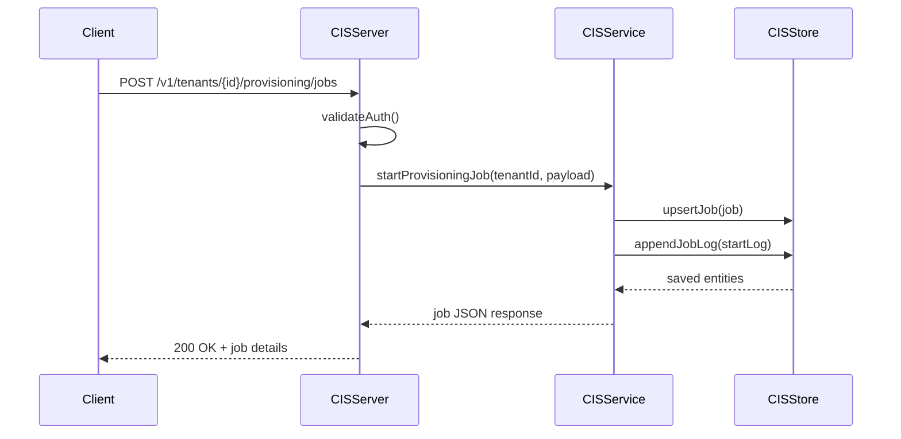

# UIM Cloud Identity Services (CIS)

Kubernetes-compatible Cloud Identity Services style service built with D, `vibe.d`, and `uim-framework`.

## Features

- Authentication and SSO with supported methods: `Form`, `SPNEGO`, `Social`, `2FA`; SSO protocol support via `OpenID Connect` and `SAML 2.0`; API-based authentication endpoint for programmatic integration
- Data persistence for users and groups in a tenant-aware Identity Directory model
- Delegate authentication to 3rd-party or on-premise IdPs via default and conditional rules (`IdP`, `email domain`, `user type`, `group`)
- Job logging and notifications for provisioning jobs, including real-time log retrieval and source-system subscription endpoints
- Policy-based authorizations for instance-based access control configured centrally as policies
- Risk-based authentication that can enforce 2FA based on IP ranges, groups, user type, or authentication method
- User and group management via SCIM-style REST API, including user invitations and localized end-user UI text customization
- User and group provisioning jobs between cloud/on-prem systems with filtering and full/delta run modes

## Build and Run

```bash
cd cis
dub build
./build/uim-sap-cis-service
```

Environment variables:

- `CIS_HOST` (default `0.0.0.0`)
- `CIS_PORT` (default `8088`)
- `CIS_BASE_PATH` (default `/api/cis`)
- `CIS_SERVICE_NAME` (default `uim-sap-cis`)
- `CIS_SERVICE_VERSION` (default `1.0.0`)
- `CIS_DEFAULT_AUTH_METHOD` (default `form`)
- `CIS_AUTH_TOKEN` (optional bearer token)

## Podman Container

```bash
cd cis
podman build -t uim-sap-cis:local -f Dockerfile .
podman run --rm -p 8088:8088 --name uim-sap-cis uim-sap-cis:local
```

## UML Description

### Component/Class View

```mermaid
classDiagram
    class App {
      +main()
    }

    class CISConfig : SAPConfig, ISAPConfig {
      +host
      +port
      +basePath
      +defaultAuthMethod
      +validate()
    }

    class CISServer {
      -_service : CISService
      +run()
      -handleRequest(req,res)
      -validateAuth(req)
    }

    class CISService : SAPService {
      -_config : CISConfig
      -_store : CISStore
      +health()
      +authenticationCapabilities()
      +login()
      +upsertUser()/listUsers()
      +upsertGroup()/listGroups()
      +upsertPolicy()/authorize()
      +upsertRiskPolicy()/evaluateRisk()
      +startProvisioningJob()/listJobLogs()
    }

    class CISStore : SAPStore {
      +upsertUser()/listUsers()
      +upsertGroup()/listGroups()
      +upsertDelegationRule()
      +upsertPolicy()/listPolicies()
      +upsertRiskPolicy()/listRiskPolicies()
      +upsertJob()/listJobs()
      +appendJobLog()/listJobLogs()
      +upsertSubscription()/listSubscriptions()
    }

    class Models {
      CISUser
      CISGroup
      CISDelegationRule
      CISAuthorizationPolicy
      CISRiskPolicy
      CISProvisioningJob
      CISJobLog
      CISNotificationSubscription
    }

    App --> CISConfig
    App --> CISService
    App --> CISServer
    CISServer --> CISService
    CISService --> CISConfig
    CISService --> CISStore
    CISStore --> Models
```

### Runtime Flow (Example: Provisioning Job)



  ### Runtime Flow (Example: Authentication + Policy + Risk)

  ```mermaid
  sequenceDiagram
    participant Client
    participant Server as CISServer
    participant Service as CISService
    participant Store as CISStore

    Client->>Server: POST /v1/tenants/{id}/auth/login
    Server->>Server: validateAuth()
    Server->>Service: login(tenantId, method)
    Service-->>Server: access token + subject
    Server-->>Client: 200 OK + login payload

    Client->>Server: POST /v1/tenants/{id}/policies/authorize
    Server->>Service: authorize(tenantId, instance/group/userType)
    Service->>Store: listPolicies(tenantId)
    Store-->>Service: policy set
    Service-->>Server: authorized=true|false
    Server-->>Client: 200 OK + authorization decision

    Client->>Server: POST /v1/tenants/{id}/risk/evaluate
    Server->>Service: evaluateRisk(tenantId, ip/group/userType/method)
    Service->>Store: listRiskPolicies(tenantId)
    Store-->>Service: risk policy set
    Service-->>Server: require_two_factor=true|false
    Server-->>Client: 200 OK + risk decision
  ```

## REST API

Base path: `/api/cis`

- `GET /health`
- `GET /ready`
- `GET /v1/auth/capabilities`
- `POST /v1/tenants/{tenant_id}/auth/login`
- `GET /v1/tenants/{tenant_id}/scim/Users`
- `POST /v1/tenants/{tenant_id}/scim/Users`
- `GET /v1/tenants/{tenant_id}/scim/Groups`
- `POST /v1/tenants/{tenant_id}/scim/Groups`
- `POST /v1/tenants/{tenant_id}/users/invite`
- `PUT /v1/tenants/{tenant_id}/ui-texts/{locale}`
- `GET /v1/tenants/{tenant_id}/delegation-rules`
- `PUT /v1/tenants/{tenant_id}/delegation-rules/{rule_id}`
- `GET /v1/tenants/{tenant_id}/policies`
- `PUT /v1/tenants/{tenant_id}/policies/{policy_id}`
- `POST /v1/tenants/{tenant_id}/policies/authorize`
- `GET /v1/tenants/{tenant_id}/risk-policies`
- `PUT /v1/tenants/{tenant_id}/risk-policies/{policy_id}`
- `POST /v1/tenants/{tenant_id}/risk/evaluate`
- `GET /v1/tenants/{tenant_id}/provisioning/jobs`
- `POST /v1/tenants/{tenant_id}/provisioning/jobs`
- `GET /v1/tenants/{tenant_id}/provisioning/logs`
- `GET /v1/tenants/{tenant_id}/provisioning/subscriptions`
- `POST /v1/tenants/{tenant_id}/provisioning/subscriptions`

### Example: create SCIM user

```bash
curl -X POST "http://localhost:8088/api/cis/v1/tenants/acme/scim/Users" \
  -H "Content-Type: application/json" \
  -d '{
    "userName": "alice",
    "email": "alice@example.com",
    "user_type": "employee",
    "groups": ["admins"]
  }'
```

### Example: start provisioning job (delta)

```bash
curl -X POST "http://localhost:8088/api/cis/v1/tenants/acme/provisioning/jobs" \
  -H "Content-Type: application/json" \
  -d '{
    "source_system": "SuccessFactors",
    "target_system": "S4HANA",
    "mode": "delta",
    "filters": {"country": "DE"}
  }'
```

## Kubernetes

```bash
kubectl apply -f k8s/configmap.yaml
kubectl apply -f k8s/deployment.yaml
kubectl apply -f k8s/service.yaml
```
