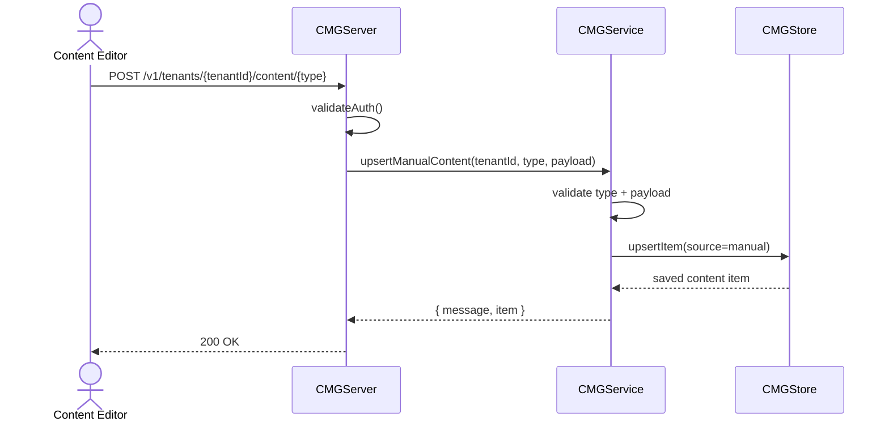
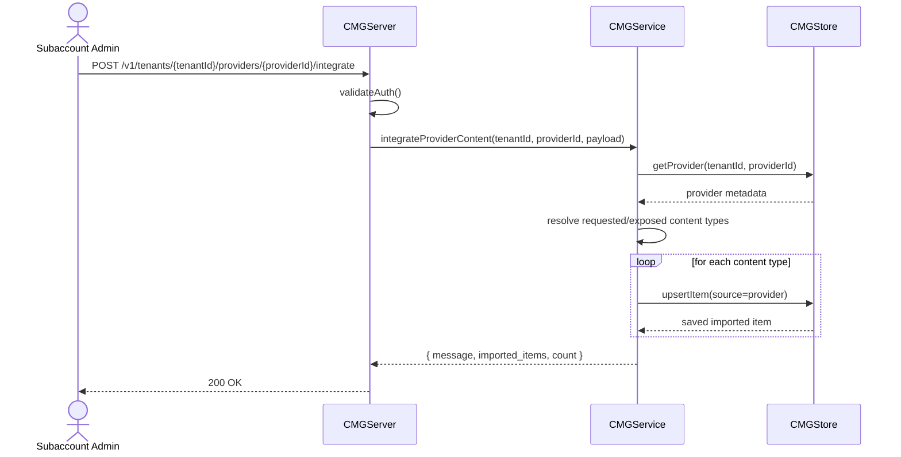

# Content Manager Service

This service provides an BTP Content Manager-like runtime for managing subaccount business content in multi-tenant environments.

## Features

- Manage business content items for your site:
  - apps
  - catalogs
  - groups
  - roles
  - shell plugins
- Add business content items to subaccounts by:
  - integrating from content providers
  - manually integrating content via content editor APIs
- Tenant isolation via `/v1/tenants/{tenantId}/...`
- Health and readiness endpoints
- Optional bearer-token protection via `CMG_AUTH_TOKEN`

## Build

```bash
dub build --root="./Content Manager"
```

## Run

```bash
CMG_AUTH_TOKEN=local-token dub run --root="./Content Manager"
```

Defaults:

- Host: `0.0.0.0`
- Port: `8095`
- Base path: `/api/cmg`

## API

### Ops

- `GET /api/cmg/health`
- `GET /api/cmg/ready`

### Manual content editor integration

- `GET /api/cmg/v1/tenants/{tenantId}/content/{apps|catalogs|groups|roles|shell-plugins}`
- `POST /api/cmg/v1/tenants/{tenantId}/content/{apps|catalogs|groups|roles|shell-plugins}`

Example payload:

```json
{
  "item_id": "sales-app",
  "title": "Sales Dashboard",
  "description": "Manually configured app",
  "tags": ["sales", "dashboard"],
  "config": {
    "url": "/ui5/sales",
    "required_role": "sales-user"
  }
}
```

### Content provider integration

- `GET /api/cmg/v1/tenants/{tenantId}/providers`
- `POST /api/cmg/v1/tenants/{tenantId}/providers`
- `POST /api/cmg/v1/tenants/{tenantId}/providers/{providerId}/integrate`

Register provider payload:

```json
{
  "provider_id": "sap-default",
  "name": "Default Provider",
  "provider_type": "sap-content",
  "endpoint": "https://provider.example/api/content",
  "exposed_types": ["apps", "catalogs", "roles"],
  "active": true
}
```

Integrate payload (optional filter):

```json
{
  "content_types": ["apps", "roles", "shell-plugins"]
}
```

## Podman

```bash
podman build -t uim-sap-cmg:latest "./Content Manager"
podman run --rm -p 8095:8095 \
  -e CMG_AUTH_TOKEN=local-token \
  uim-sap-cmg:latest
```

## Kubernetes

```bash
kubectl apply -f "./Content Manager/k8s/configmap.yaml"
kubectl apply -f "./Content Manager/k8s/deployment.yaml"
kubectl apply -f "./Content Manager/k8s/service.yaml"
```

Optional auth secret:

```bash
kubectl create secret generic uim-sap-cmg-secret \
  --from-literal=authToken=local-token
```

## UML Description

Note: Render the following diagrams with a PlantUML-compatible Markdown viewer/extension.

### Class Diagram

```mermaid
classDiagram
    class CMGConfig : SAPConfig {
      +string host
      +ushort port
      +string basePath
      +string serviceName
      +string serviceVersion
      +bool requireAuthToken
      +string authToken
      +validate() void
    }

    class CMGContentItem {
      +string tenantId
      +string itemId
      +string contentType
      +string title
      +string source
      +string sourceRef
      +Json config
      +toJson() Json
    }

    class CMGContentProvider {
      +string tenantId
      +string providerId
      +string name
      +string providerType
      +string endpoint
      +string[] exposedTypes
      +bool active
      +toJson() Json
    }

    class CMGStore : SAPStore {
      +upsertItem(item) CMGContentItem
      +listItems(tenantId, contentType) CMGContentItem[]
      +upsertProvider(provider) CMGContentProvider
      +listProviders(tenantId) CMGContentProvider[]
      +getProvider(tenantId, providerId) Nullable!CMGContentProvider
    }

    class CMGService : SAPService {
      +health() Json
      +ready() Json
      +listContent(tenantId, contentType) Json
      +upsertManualContent(tenantId, contentType, body) Json
      +listProviders(tenantId) Json
      +upsertProvider(tenantId, body) Json
      +integrateProviderContent(tenantId, providerId, body) Json
    }

    class CMGServer {
      +run() void
      -handleRequest(req, res) void
      -validateAuth(req) void
      -respondError(res, message, statusCode) void
    }

    CMGServer --> CMGService : routes to
    CMGService --> CMGConfig : uses
    CMGService --> CMGStore : orchestrates
    CMGStore --> CMGContentItem : persists
    CMGStore --> CMGContentProvider : persists
```

### Sequence Diagram (Manual Content Integration)



### Sequence Diagram (Provider Content Integration)



  ### Sequence Diagram (Content Retrieval with Tenant Isolation)

  ```mermaid
  sequenceDiagram
    actor User as Site Admin
    participant API as CMGServer
    participant Svc as CMGService
    participant Store as CMGStore

    User->>API: GET /v1/tenants/{tenantId}/content/{type}
    API->>API: validateAuth()
    API->>Svc: listContent(tenantId, type)
    Svc->>Svc: validate tenantId + content type
    Svc->>Store: listItems(tenantId, type)
    Store-->>Svc: tenant-scoped items only
    Svc-->>API: { tenant_id, content_type, items, count }
    API-->>User: 200 OK
  ```
